# segspec

**From app configs to Kubernetes NetworkPolicies in seconds.**

```mermaid
graph LR
    A["📁 App Configs<br/>Docker Compose, Helm,<br/>K8s, Spring Boot"] -->|segspec analyze| B["⚙️ segspec"]
    B --> C["🛡️ NetworkPolicies<br/>Per-service YAML"]
    C --> D["☸️ kubectl apply"]
```

[](https://go.dev)
[](LICENSE)
[](https://github.com/dormstern/segspec/actions)



---

## Before / After

| | The Old Way | With segspec |
|---|---|---|
| **Step 1** | Deploy runtime agents across every pod | `go install` one binary |
| **Step 2** | Wait 30-60 days for "learning period" | Point at a repo |
| **Step 3** | Three teams (security + platform + app) review traffic maps | Read the output |
| **Step 4** | Manually write NetworkPolicy YAML per service | Already done |
| **Step 5** | Repeat every time infra changes | Re-run the command |
| **Time** | 4-6 weeks | 30 seconds |
| **Cost** | $50K+ in engineering hours | Free |

Your configs already declare every dependency. Why are we paying for packet inspection?

---

## Quick Start

```bash
# With Go
go install github.com/dormstern/segspec@latest

# Or download the binary (macOS/Linux)
curl -sL https://github.com/dormstern/segspec/releases/latest/download/segspec_0.4.1_$(uname -s | tr '[:upper:]' '[:lower:]')_$(uname -m).tar.gz | tar xz -C /usr/local/bin segspec
```

**Try it now** -- scan Sentry's 70+ service production stack:

```bash
segspec analyze https://github.com/getsentry/self-hosted
```

That's it. NetworkPolicies for 71 services in under a second.

### Apply to your cluster

```bash
segspec analyze ./your-repo --format per-service --output ./networkpolicies
kubectl apply -f ./networkpolicies
```

---

## Real-World Results

We scanned real production apps -- not toy demos -- to show what segspec finds in software thousands of companies actually run.

### Sentry self-hosted (70+ services)

[getsentry/self-hosted](https://github.com/getsentry/self-hosted) -- the most popular open-source error monitoring platform.


| Metric | Result |
|--------|--------|
| Dependencies found | 411 |
| NetworkPolicies generated | 71 |
| Scan time | 11ms |
| Infrastructure | Kafka, Redis, Memcached, PostgreSQL, ClickHouse, Snuba, Symbolicator |

### PostHog (25+ services)

[PostHog/posthog](https://github.com/PostHog/posthog) -- open-source product analytics used by 100K+ teams.


| Metric | Result |
|--------|--------|
| Dependencies found | 23 |
| NetworkPolicies generated | 12 |
| Scan time | 128ms |
| Infrastructure | Kafka, Redis, PostgreSQL, Redpanda, MinIO |

### Google Online Boutique (11 services)

[GoogleCloudPlatform/microservices-demo](https://github.com/GoogleCloudPlatform/microservices-demo) -- Google's microservices reference architecture.

- 34 dependencies found in under 1 second
- Entire service mesh mapped at high confidence, zero false positives

---

## How It Works

segspec statically analyzes your config files. No agents, no runtime access, no observation window.

It reads the connection strings, service references, and port declarations you already wrote -- and turns them into NetworkPolicy YAML.

| Config Type | Files |
|---|---|
| Docker Compose | `docker-compose.yml` |
| Kubernetes | Deployments, Services, ConfigMaps |
| Helm Charts | `Chart.yaml` + templates (rendered via `helm template`) |
| Spring Boot | `application.yml`, `application.properties` |

---

## Output Formats

**Summary** (default) -- dependency count + policy overview to stdout.

```bash
segspec analyze ./repo
```

**Per-service** -- one NetworkPolicy YAML file per service, ready for `kubectl apply`.

```bash
segspec analyze ./repo --format per-service --output ./policies
```

**Interactive** -- explore dependencies and policies in your terminal.

```bash
segspec analyze ./repo --interactive
```

---

## AI Mode

For repos with non-standard config patterns, segspec can use an LLM to infer additional dependencies.

```bash
segspec analyze ./repo --ai local    # Uses local Ollama
segspec analyze ./repo --ai cloud    # Uses cloud LLM API
```

AI mode supplements -- never replaces -- the static analysis results.

---

## CI/CD Integration

Add microsegmentation policy generation to every PR.

```yaml
# .github/workflows/segspec.yml
name: Generate NetworkPolicies
on: [pull_request]

jobs:
  segspec:
    runs-on: ubuntu-latest
    steps:
      - uses: actions/checkout@v4
      - uses: actions/setup-go@v5
        with:
          go-version: '1.26'
      - run: go install github.com/dormstern/segspec@latest
      - run: segspec analyze . --format per-service --output ./networkpolicies
      - uses: actions/upload-artifact@v4
        with:
          name: networkpolicies
          path: ./networkpolicies
```

---

## FAQ

**Does this require cluster access?**
No. segspec reads config files only. It never touches your cluster.

**What if my configs don't cover all dependencies?**
Use `--ai` mode to catch non-standard patterns, or add them manually. segspec tells you its confidence level for each dependency.

**Can it replace my CNI/service mesh?**
No. segspec generates the policies. You still need a CNI that enforces them (Calico, Cilium, etc.).

**Is this just for Kubernetes?**
Today, yes. AWS Security Groups and Cilium NetworkPolicy are on the roadmap.

**What about false positives?**
Static analysis is conservative by design. In our benchmarks against production repos, we've seen zero false positives.

---

## Roadmap

- **GitHub Action** -- `uses: dormstern/segspec-action@v1` for one-line CI integration
- **Multi-format output** -- AWS Security Groups, Cilium, Calico native policies

---

If this saves you from a 6-week microsegmentation project, consider giving it a star.

[**Star segspec on GitHub**](https://github.com/dormstern/segspec)
